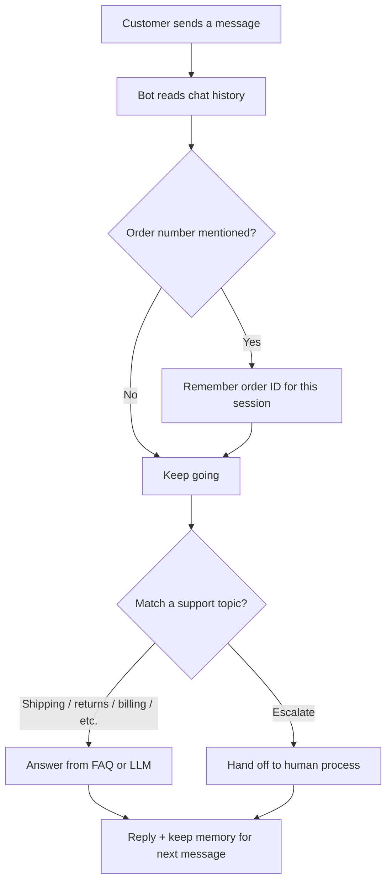
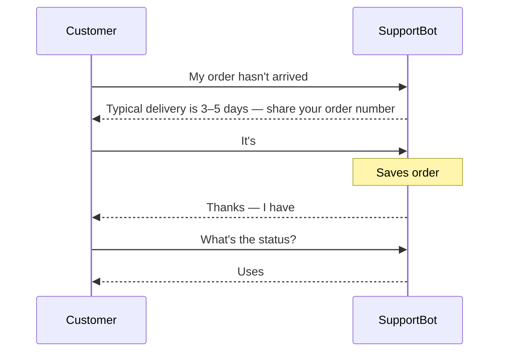

# AI Customer Support Chatbot

**Author:** Hammad Durrani (HDxpert)  
**Live demo:** https://hammad-ml-dev.github.io/Ai-customer-support-chatbot/

---

## About this tool

This tool is a **customer support assistant** for a fictional store (NovaGear). It answers everyday shopper questions the way a real helpdesk bot should: shipping delays, returns, billing, password resets, and when to escalate to a human.

Unlike a general ChatGPT clone, this bot is **trained on support scenarios**. It remembers what you already said in the chat (for example your order number `#12345`) so follow-up questions feel natural.

**Who it’s for**
- People learning how support bots use memory + FAQs  
- Recruiters who want a realistic support conversation demo  
- Builders who want a small, focused support product — not a full chat playground  

**What customers can ask**

| Topic | Example |
|-------|---------|
| Shipping | “My order hasn’t arrived yet” |
| Order status | “It’s #12345” → bot keeps that ID in memory |
| Returns / refunds | “How do returns work?” |
| Account access | “I need to reset my password” |
| Billing | “Why was I charged twice?” |
| Human help | Type `escalate` |

Demo mode uses a built-in FAQ pack (**no API key**). With Groq, replies come from a live LLM with the same support role.

---

## How a support chat flows



### Example conversation path



---

## What makes this different from Mini ChatGPT

| This tool | Mini ChatGPT |
|-----------|--------------|
| Helpdesk for shoppers | General ChatGPT-style chat |
| Remembers order IDs + FAQ topics | Threads + many LLM providers |
| Built for support workflows | Built for open-ended conversation |

---

## Try it

1. **Live demo:** https://hammad-ml-dev.github.io/Ai-customer-support-chatbot/  
2. **Local CLI:**

```bash
git clone https://github.com/hammad-ml-dev/Ai-customer-support-chatbot.git
cd Ai-customer-support-chatbot
python -m venv .venv
.\.venv\Scripts\Activate.ps1
pip install -r requirements.txt
copy .env.example .env
python chatbot.py
```

Commands in the CLI: `save` (export chat JSON) · `reset` (clear memory) · `quit`

Flask UI: `set PYTHONPATH=src` then `python web/app.py` → http://127.0.0.1:5056

---

## Learning path

1. Open the live demo and send the sample chips **in order** (delay → order # → follow-up)  
2. Read `src/support/knowledge.py` then `src/support/bot.py`  
3. Add one new FAQ topic (e.g. warranty)  

---

## Built with

Python · FAQ knowledge pack · optional Groq · Flask (local UI)

---

Shared for learning and portfolio demonstration. Please credit **Hammad Durrani**.
